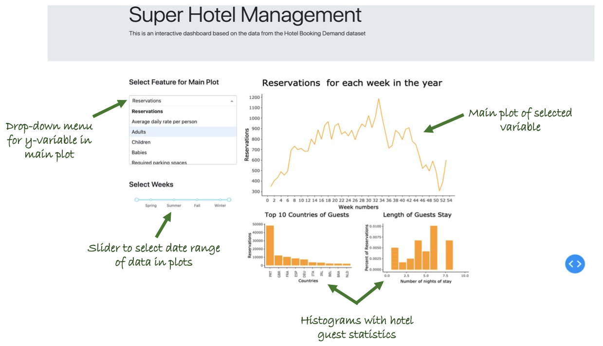

# Super Hotel Management

[View Dashboard](https://dsci532group20deployinr.herokuapp.com/)

This app generates a time-series plot of user-selected variables in the hotel reservation dataset. The variable of interest to be plotted is selected from a drop-down menu. Along with the main plot, histograms plots containing useful information about guests have been included. The data in these plots update with the two interactive plotting filters described below. 

A slider allows users to control the date range of the data displayed. Radio buttons allow users to select between city hotels, resort hotels, or both types.

