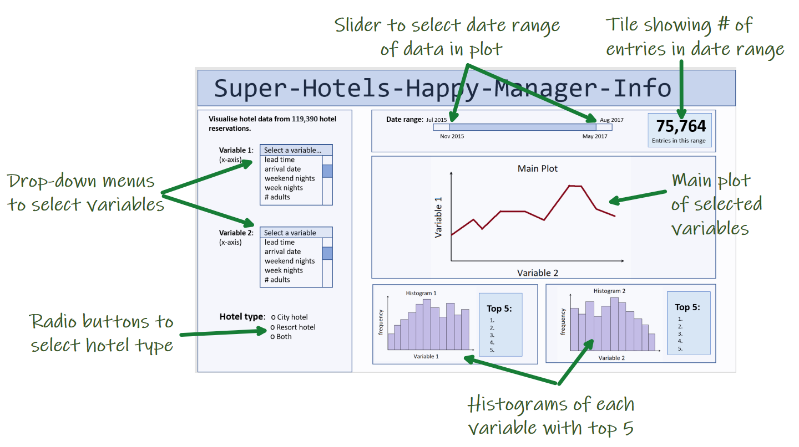

# Super-Hotels-Happy-Manager-Info

This app generates a plot of any two of the variables in the hotel reservation dataset. The variables to be plotted are selected from drop-down menus. Depending on the type of variable the plot may be a line plot, scatter plot, or bar chart. Along with the main plot, a histogram of each of the x and y variables will be plotted, with a summary of the top five most common entries from the histogram.

A slider will allow users to control the date range of the data displayed. A tile will display how many entries are displayed in the selected date range. Radio buttons will allow users to select between city hotels, resort hotels, or both types.

